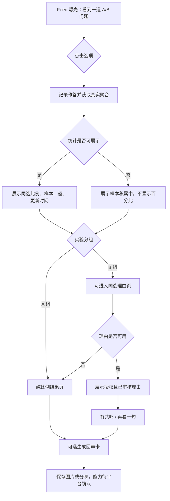

# 同频一下｜陌生人默契实验 产品需求文档（PRD）

> 文档状态：待能力确认 / 实验预注册稿  
> PRD 版本：v1.0  
> 依据文档：《同频一下｜陌生人默契实验 产品需求文档（PRD）》v1.2（2026-07-15）  
> 源文档：[飞书原文](https://uc0ss5wryl.feishu.cn/docx/APstd09bsoUvbWx19z1cxP1Nnoh)  
> 产品阶段：Phase 0，能力确认与素材准备  
> 一句话定义：在抖音信息流中，用一道没有标准答案的轻问题，让用户看见真实群体比例，并读到一条经授权、已审核的同选理由，获得一次短暂、安全、无社交压力的共鸣。

---

## 1. Summary｜产品摘要

「同频一下」是一项面向抖音兴趣卡场景的轻量匿名共鸣实验。用户完成一道 A/B 选择后，先看到同选答案的真实作答占比，再按需阅读一条来自授权理由池的匿名理由。

本期不做实时陌生人匹配，不读取平台兴趣标签，不展示“兴趣重合度”，不开放用户自由文本。MVP 的核心任务是验证：在相同题目和真实比例下，一条具体、真实、已授权的匿名理由，是否比纯比例更能让用户感到“原来不只我这样想”。

产品不是交友、匿名聊天、心理测评或人格测试。它不建立人与人之间的关系，也不提供私信、关注、主页跳转或持续匹配能力。

### 1.1 产品原则

1. **真实优先**：页面上的数字、理由和来源说明都必须可追溯，不能用随机数、模板或 AI 内容伪装真人结果。
2. **低负担**：用户在 1–2 秒内看懂问题，一次点击完成作答，无需解释。
3. **无关系压力**：不给用户分配“匹配对象”，不产生联系入口，不要求继续社交。
4. **安全默认**：首期不接收自由文本，从源头降低辱骂、引流、隐私泄露和审核压力。
5. **实验先行**：先验证“真实理由的增量价值”，再决定是否建设投稿、审核或实时匹配等高成本能力。
6. **诚实降级**：数据不足、理由不可用或服务异常时，展示更少的信息，而不是制造看似完整的体验。

### 1.2 本期核心决策

- 保留：A/B 轻问题、真实比例、授权理由池、共鸣反馈、回声卡分享、A/B 实验。
- 删除：兴趣重合度、随机百分比分数、人格标签、实时匹配等待动画、“刚刚遇见某人”等承诺。
- 延后：用户投稿、开放文本、实时撮合、跨用户关系能力。
- 先决条件：平台能力、统计口径、理由授权审核链路和安全降级全部通过门禁后，才可进入开发上线阶段。

---

## 2. Contacts｜联系人与职责

下列姓名由项目负责人在评审前补齐。没有明确责任人的事项不能进入上线排期。

| 角色 | 姓名 | 主要职责 | 评审/签字事项 | 当前状态 |
|---|---|---|---|---|
| 产品负责人 | 待确认 | 产品范围、优先级、指标、跨团队决策 | PRD、实验方案、上线结论 | 待指定 |
| 业务负责人 | 待确认 | 业务目标、资源投入、阶段继续/停止 | 阶段预算、发布决策 | 待指定 |
| 交互/视觉设计 | 待确认 | 用户路径、页面状态、视觉规范、无障碍 | 设计稿、文案、异常态 | 待指定 |
| 客户端/兴趣卡研发 | 待确认 | 卡片交互、状态管理、埋点、分享 | 技术方案、客户端验收 | 待指定 |
| 服务端研发 | 待确认 | 聚合数据、实验分组、理由分发、风控接口 | 数据一致性、性能与降级 | 待指定 |
| 数据分析 | 待确认 | 指标字典、样本量、实验分析、复算 | 预注册方案、实验报告 | 待指定 |
| 内容运营 | 待确认 | 题库、理由征集、授权、复核、下线 | 首期素材验收 | 待指定 |
| 内容安全 | 待确认 | 风险规则、双审标准、举报与应急 | 题库/理由池安全验收 | 待指定 |
| 隐私/法务 | 待确认 | 授权文本、撤回机制、数据最小化 | 隐私与授权合规评审 | 待指定 |
| 平台接口人 | 待确认 | 兴趣卡能力、Feed 条件、审核和分享能力 | G1–G4 能力确认 | 待指定 |
| 测试负责人 | 待确认 | 功能、数据、异常、安全和回归测试 | 上线验收报告 | 待指定 |

### 2.1 决策机制

- 产品范围变化：产品负责人提出，研发、数据、安全共同评估，业务负责人确认。
- 指标口径变化：数据分析负责人提出并更新版本；实验开始后不得无记录修改主指标。
- 题目或理由下线：内容安全可立即执行；事后补充原因、影响范围和恢复结论。
- 上线或扩量：必须由产品、研发、数据、安全四方共同确认。
- 进入下一阶段：只能依据上一阶段的预注册结果和护栏指标，不能凭主观好评直接推进。

---

## 3. Background｜背景

### 3.1 用户问题

信息流用户常有短暂的表达和好奇：面对一个生活情境，他们愿意快速做选择，也想知道“别人会怎么选”。但公开评论、发帖或进入陌生人社交，会带来表达压力、身份暴露、争论和关系维护成本。

现有轻互动常停在投票比例。比例能回答“有多少人和我一样”，却很难回答“他们为什么这样想”。而一句具体、克制、来自真实同选者的理由，可能比抽象数字更容易带来被理解感。

因此，本产品聚焦一个窄问题：**能否在不建立关系、不暴露身份、不开放自由表达的前提下，用真实比例和真实理由，为用户提供一次短暂共鸣？**

### 3.2 为什么现在做

- 兴趣卡已支持个性化、可交互的 AI 内容形态，并可接入 MCP / HTTP 工具，为轻量作答和结果反馈提供了载体。
- 兴趣卡可在侧边栏、IM 等场景分发；Feed 分发存在明确门槛，可用真实行为数据验证题面吸引力。
- 当前可通过预征集、明确授权和人工复核建立小规模理由池，从而在不开放 UGC 的情况下测试情绪价值。
- 现阶段尚不能确认跨用户实时撮合、平台兴趣标签、卡内分享回流和自由文本审核能力，因此更适合先做低风险的最小实验。

### 3.3 已知能力与未知边界

#### 已验证，可作为方案输入

- 兴趣卡支持个性化和交互内容。
- 兴趣卡可连接 MCP / HTTP 工具。
- 兴趣卡存在侧边栏、IM 等分发场景。
- 当前邀约材料给出的 Feed 分发门槛为：兴趣卡点击率 ≥ 6%，skip 率 ≤ 70%。这是平台门槛，不代表本产品已经达成。

#### 尚未验证，禁止写成既有能力

- 开发者可以直接读取抖音平台兴趣标签。
- 可以计算跨用户的“兴趣重合度”。
- 兴趣卡容器支持稳定、低延迟的跨用户实时撮合。
- 卡内保存图片、分享、回流的接口和审核要求已经明确。
- 自由文本能够满足业务要求的审核时效、申诉、撤回和追责能力。

### 3.4 产品实验假设

| 编号 | 假设 | 验证方式 | 若不成立 |
|---|---|---|---|
| H1 | 高情境、低判断成本的 A/B 题能达到 Feed 分发门槛 | 观察点击率、skip 率、作答率 | 优先改题面和首屏，不扩充匹配能力 |
| H2 | 增加真实匿名理由会提升共鸣反馈 | 用户级固定分组 A/B 实验 | 停止扩建理由池，保留纯比例玩法 |
| H3 | 理由的具体性和温度，比“匹配感”或伪精确分数更重要 | 分层分析理由特征与共鸣率 | 调整理由标准或终止理由能力 |
| H4 | 明确“非实时匹配”不会明显损害体验，并能提升可信度 | 观察理由展开、负反馈和用户研究 | 优化说明位置与表达，不做虚假承诺 |
| H5 | 不建立关系也能产生足够的单次情绪价值 | 观察共鸣、再看一句和分享行为 | 回到纯投票工具定位或停止项目 |

### 3.5 约束

- 首期题目数量：10 道。
- 首期每个选项理由：20–30 条，经明确授权和人工双审。
- 题目必须低敏感、无标准答案、选项互斥。
- 理由不能包含姓名、联系方式、精确地点、单位、学校等可识别信息。
- Phase 1 不接收用户自由文本。
- 所有比例必须来自真实作答聚合，且可说明样本量、统计窗口和更新时间。
- 在平台能力未确认前，PRD 中的技术方案均为候选方案，不代表接口已经存在。

---

## 4. Objective｜目标与成功标准

### 4.1 产品目标

用最小成本验证“比例 + 真实理由”是否能在安全、可信的前提下，为信息流用户带来比“纯比例”更强的共鸣感，并判断该方向是否值得继续投入。

### 4.2 用户价值

- 用户可以低负担表达自己的当下选择。
- 用户能看到自己在真实群体中的位置。
- 用户能读到一句来自同选者的具体理由，获得“有人也这样想”的感受。
- 用户无需公开身份、发表长文或进入陌生关系。

### 4.3 公司与平台价值

- 将一次被动刷流转化为可测量的轻互动。
- 在控制 UGC、隐私和陌生人社交风险的情况下探索情绪价值内容。
- 用小规模实验先验证价值，避免过早投入实时撮合、开放投稿和复杂审核系统。
- 建立可复用的轻问题题库、授权理由池、聚合统计和实验评估能力。

### 4.4 非目标

- 不提高陌生人关系建立率。
- 不帮助用户找到好友、恋爱对象或聊天对象。
- 不进行心理诊断、人格归类或兴趣画像。
- 不追求无限内容消费时长。
- 不在本期验证实时撮合的成功率或延迟。
- 不把分享量作为牺牲隐私、真实性或安全的理由。

### 4.5 SMART Key Results

所有提升幅度和统计样本量由首轮基线及功效分析确定。评审前不得填入未经计算的目标值。

#### KR1：达到可继续实验的分发条件

- 在 Phase 1 首轮完整实验窗口内，兴趣卡点击率达到平台要求的 ≥ 6%。
- 同一窗口内，skip 率不高于平台要求的 70%。
- 同时报告曝光量、有效用户数、题目分层结果和置信区间。

#### KR2：验证真实理由的增量价值

- 在完成预注册样本量后，比较 A 组“纯比例”和 B 组“比例 + 理由”的等价正向反馈率。
- B 组的增量必须同时满足：统计上可信、业务上有意义、题目间方向基本一致。
- “业务上有意义”的最小提升幅度由基线和成本测算后，在实验开始前冻结。

#### KR3：确保内容和隐私安全

- 上线理由 100% 具备可追溯的授权记录、审核状态和内容版本。
- 已撤回或已下线理由的继续分发数为 0。
- 严重隐私泄露、身份暴露、关系引流事件为 0。
- 举报率和负反馈率不得超过上线前由内容安全确认的阈值；阈值需在扩量前冻结。

#### KR4：确保数据可信和可复算

- 核心事件上报完整率达到数据团队确认的上线阈值。
- A/B 分组稳定，无已知串组；同一用户在实验期间保持同组。
- 展示比例与服务端聚合结果在抽样核对中一致。
- 主指标、护栏指标和分层结果可由原始事件复算。

### 4.6 决策规则

| 结果 | 决策 |
|---|---|
| 未达到 Feed 分发门槛 | 只迭代题目、首屏和入口；不建设投稿或撮合 |
| 达到门槛，但理由没有增量 | 停止扩建理由池，评估保留纯比例玩法 |
| 理由有增量，但安全护栏不稳定 | 暂停扩量，先修复审核、下线和降级能力 |
| 理由有增量，且护栏稳定 | 进入 Phase 2 受控投稿评估 |
| 平台未确认跨用户能力 | 不进入实时匹配，不用文案模拟能力 |

---

## 5. Market Segments｜目标市场与用户分群

本产品按用户要完成的“任务”分群，不以年龄、性别等人口属性定义市场。

### 5.1 核心用户：想轻轻表达，但不想公开发言的人

**情境**：刷到一个与当下生活或情绪有关的问题。  
**任务**：快速表达“此刻我会怎么选”，顺便看别人怎么想。  
**顾虑**：不想写评论，不想被反驳，不想留下长期公开记录。  
**成功体验**：一次点击完成选择，看到真实比例后觉得“原来还有人和我一样”。

### 5.2 高价值用户：想被理解，但不想进入关系的人

**情境**：用户对某个日常选择有个人感受，愿意读一句同选理由。  
**任务**：找到具体的心理共鸣，而不是认识一个陌生人。  
**顾虑**：担心私信、骚扰、身份暴露、关系维护。  
**成功体验**：读到一句真实、克制、具体的理由，产生被理解感，然后自然离开。

### 5.3 次要用户：好奇群体选择的人

**情境**：问题本身引发好奇，用户主要想看结果。  
**任务**：知道不同选择的真实比例。  
**顾虑**：不想被长流程或强制分享打断。  
**成功体验**：作答后马上看到清楚、可信、有口径的统计结果。

### 5.4 暂不服务的用户与场景

- 想聊天、加好友、找对象或持续互动的人。
- 想公开发表长观点或参与辩论的人。
- 需要专业心理、医疗或法律判断的人。
- 涉及政治、违法、医疗诊断、性、灾难创伤、未成年人隐私等高敏感题目。
- 需要基于精确地点、学校、单位或身份属性进行连接的场景。

### 5.5 使用限制

- 用户必须能在单屏内读懂题目和选项。
- 不依赖用户授予通讯录、定位或社交关系权限。
- 不要求用户填写个人资料。
- 如产品可能触达未成年人，须先完成单独的合规评审、题库规则和数据策略；完成前不得定向投放。
- 对视觉、阅读或操作障碍用户，核心信息不能只依赖颜色表达；按钮需要明确文字和足够触控区域。

---

## 6. Value Propositions｜价值主张

### 6.1 用户任务、痛点与收益

| 用户任务 | 现有痛点 | 产品提供的能力 | 用户收益 |
|---|---|---|---|
| 快速表达此刻选择 | 发评论成本高，容易被评价 | 一道 A/B 题，一次点击完成 | 低负担表达 |
| 知道别人怎么选 | 普通投票可能缺少口径或真实性 | 真实作答聚合、样本量、统计窗口 | 看见自己在人群中的位置 |
| 理解同选者为什么这样选 | 纯比例没有温度，评论区噪声大 | 一条同选、授权、已审核的匿名理由 | 获得具体共鸣 |
| 保持匿名和安全 | 陌生社交可能带来骚扰和追踪 | 不展示身份，不提供关系入口 | 无社交压力 |
| 分享自己的选择 | 分享他人原话可能侵犯授权 | 只分享本人选择、群体比例和产品文案 | 可控、低风险地表达 |

### 6.2 相比替代方案的差异

| 体验维度 | 普通投票 | 评论区 | 陌生人匹配 | 同频一下 MVP |
|---|---:|---:|---:|---:|
| 作答成本 | 低 | 高 | 中到高 | 低 |
| 真实群体比例 | 常有，但口径不一定清楚 | 无 | 通常无 | 有，且说明口径 |
| 具体理由 | 无 | 多，但噪声和冲突高 | 有 | 有，经过授权和审核 |
| 身份暴露风险 | 低 | 中到高 | 高 | 低 |
| 关系维护压力 | 无 | 中 | 高 | 无 |
| 审核与安全可控性 | 高 | 低 | 低 | 较高 |
| 实时匹配感 | 无 | 无 | 强 | 明确不提供 |

### 6.3 价值曲线

本产品有意做出以下取舍：

- **消除**：头像、昵称、主页、私信、关注、关系建立、人格标签、伪精确匹配分。
- **降低**：表达长度、互动步骤、选择难度、长期承诺。
- **提高**：统计真实性、来源透明度、内容安全、理由具体性、异常降级的诚实程度。
- **创造**：介于“冷冰冰的投票”和“高压力陌生社交”之间的一次性匿名共鸣体验。

### 6.4 核心承诺与禁止承诺

**可以承诺**：

- “比例来自本题真实作答汇总。”
- “这是一条来自已授权匿名理由库的同选理由。”
- “不展示主页，不建立关系。”

**禁止承诺**：

- “正在为你寻找最同频的人。”
- “你们的兴趣重合度是 98%。”
- “刚刚有一个陌生人和你匹配成功。”
- “这条理由来自刚刚和你同时作答的人。”
- 任何心理诊断、人格判定或“正常人都这样选”的暗示。

---

## 7. Solution｜解决方案

### 7.1 整体体验与用户流程

Phase 1 的完整路径为四个页面：

Phase 2 才可能在理由页增加“我也想留一句”，并进入受控投稿流程。Phase 1 必须隐藏该入口。

### 7.2 UX 与原型

此前输出的多套高保真视觉稿已经与当前产品定位和实际页面流程不一致，因此不再作为设计或验收依据。当前先以 MVP 线框图确认页面结构、内容层级和交互路径；新的高保真方案应在实际实现约束确认后重新制作，并经过可读性和平台适配评审。

当前设计基线：

- [MVP 全流程线框图](../designs/wireframes/all-pages.png)
- [可交互线框图源文件](../designs/wireframes/index.html)

#### 7.2.1 页面 01：遇见问题

**目标**：用户在 1–2 秒内理解问题并完成一次选择。

**页面内容**：

- 品牌名“同频一下”和副标题“一次轻量的匿名共鸣实验”。
- “今日共鸣实验”标识。
- 真实累计作答量；若无法提供真实数据，隐藏该数字，不使用静态占位数。
- 一道问题和两个互斥选项。
- 明示“匿名选择 · 无需填写理由”。
- 底部辅助文案：“没有标准答案，只想知道此刻的你会怎么选。”

**交互要求**：

- 用户点击选项后立即进入提交状态，防止重复点击。
- 提交成功后进入结果页。
- 提交失败时允许重试；不得在失败时展示伪造比例。
- 选项顺序是否随机由数据团队确认；若随机，必须记录展示顺序。

#### 7.2.2 页面 02：看见同类

**目标**：用清楚、可信的方式回答“有多少人和我一样”。

**页面内容**：

- 显示用户刚才选择的选项。
- 主反馈：“全国有 X% 的人和你一样”；“全国”是否准确须由实际样本来源决定。若样本不代表全国，应改为“本题已有 X% 的作答者和你一样”。
- 100 点阵或其他辅助图形；数字和图形必须来自同一份聚合结果。
- 数据说明：真实作答汇总、有效样本数、统计窗口、更新时间。
- B 组显示 CTA“看看他们怎么想”；A 组不得显示该入口。

**展示条件**：

- 有效样本达到最小阈值后才显示百分比。
- 百分比舍入规则由数据团队冻结，页面数字与点阵允许的最大视觉误差需明确。
- 聚合超时、数据校验失败或样本不足时，进入降级状态。

#### 7.2.3 页面 03：一句同频理由

**目标**：让用户读到一句真实、具体、与自己选项一致的匿名理由。

**页面内容**：

- 标题：“一个做出相同选择的人这样想”。
- 一条理由正文。
- 来源说明：“来自已授权匿名理由库 · 非实时匹配”。
- 操作：“这句话有共鸣”“再看一句”。
- 安全说明：“不可私信 · 不展示主页 · 不建立关系”。

**交互要求**：

- “有共鸣”对同一理由只记录一次有效反馈；重复点击需幂等。
- “再看一句”只从同题、同选项的合格理由中选取。
- 同一用户单日不重复看到同一理由。
- 理由不足时隐藏“再看一句”，不得用 AI 或模板补齐真人理由。
- 理由在展示期间被撤回或下线时，下次请求必须停止返回。

#### 7.2.4 页面 04：分享回声卡

**目标**：让用户安全地分享自己的选择与群体位置，而不是分享他人身份或原话。

**页面内容**：

- 标题“今日同频选择”。
- 本人选择、群体比例、产品生成的摘要文案。
- 日期和品牌标识。
- 脚注：“只包含我的选择与群体比例”。

**禁止内容**：

- 不直接展示或分享理由作者原话。
- 不出现“陌生人”“匹配成功”“兴趣重合度”。
- 不包含头像、昵称、主页、用户 ID 或可识别信息。

**能力边界**：

- 保存图片、系统分享、回流链接和审核要求均需平台确认。
- 若分享能力未通过门禁，Phase 1 可以隐藏整个分享入口，不影响核心实验。

#### 7.2.5 页面 05：引导式共鸣回声（Phase 2，Phase 1 不上线）

**目标**：让用户知道为什么输入、输入什么、提交后去哪里，并完成匿名展示授权。

**要求**：

- 标题：“为什么你也会这样选择？”
- 副提示：“写下一句理由，让以后做出相同选择的人看见。”
- 句式引导与输入框，长度 10–60 字。
- 示例只能作为提示，不能自动成为用户投稿。
- 授权勾选默认不勾选。
- 未满 10 字、未授权或命中风险规则时不可提交，并说明原因。
- 成功文案不得承诺一定展示。
- 审核通过前不得进入理由池；用户需有撤回授权入口。

### 7.3 功能需求

#### 7.3.1 题目管理

| ID | 需求 | 优先级 | 验收要点 |
|---|---|---|---|
| Q-01 | 支持配置题干、A/B 选项、状态、版本、风险等级 | P0 | 每次修改产生新版本；历史事件保留原版本 |
| Q-02 | 首期配置 10 道可上线题目 | P0 | 每题通过产品与内容安全评审 |
| Q-03 | 题干不超过 24 个汉字，单个选项不超过 10 个汉字 | P0 | 超长内容不能发布 |
| Q-04 | 题目支持上线、暂停、下线 | P0 | 下线后新曝光不再返回该题 |
| Q-05 | 支持按分发场景选择题目 | P1 | 每次曝光记录题目和场景 |
| Q-06 | 支持题目版本冻结 | P0 | 实验期间修改需创建新版本并记录原因 |

**题目标准**：

- 一眼能懂，选项互斥。
- 双方都有可理解的生活逻辑，不暗示道德高低。
- 不使用“正常人都选”“高情商的人会”等诱导语言。
- 首期排除政治、医疗诊断、违法、性、未成年人隐私、灾难创伤等议题。

#### 7.3.2 作答与聚合

| ID | 需求 | 优先级 | 验收要点 |
|---|---|---|---|
| A-01 | 接收并记录用户选项 | P0 | 请求幂等；重复提交不重复计数 |
| A-02 | 返回同题同版本的真实聚合结果 | P0 | 选项计数之和与有效样本数一致 |
| A-03 | 支持配置统计窗口 | P0 | 响应中返回窗口和更新时间 |
| A-04 | 支持最小样本量门槛 | P0 | 未达门槛不返回可展示百分比 |
| A-05 | 支持反刷和异常流量剔除 | P0 | 规则、剔除量和版本可审计 |
| A-06 | 聚合失败时返回明确状态 | P0 | 客户端进入诚实降级，不显示旧假新数据 |
| A-07 | 比例展示口径一致 | P0 | 数字、文案、点阵和分享卡来自同一快照 |

**比例口径待确认项**：

- 用户去重键及匿名化方案。
- 有效作答定义。
- 统计窗口：累计、近 7 日或滚动窗口。
- 最小样本量阈值。
- 百分比舍入和两选项合计不等于 100% 时的显示规则。
- “全国”表述是否具备样本代表性。

#### 7.3.3 实验分组

| ID | 需求 | 优先级 | 验收要点 |
|---|---|---|---|
| E-01 | 按用户随机分配 A/B 组 | P0 | 分配比例符合配置，组间基础特征无明显失衡 |
| E-02 | 实验期内固定分组 | P0 | 同一用户多次访问不串组 |
| E-03 | A 组只展示比例结果 | P0 | 不出现理由入口或理由事件 |
| E-04 | B 组展示比例并可进入理由 | P0 | 入口曝光、点击、理由展示均可追踪 |
| E-05 | 记录实验 ID、版本、分组时间 | P0 | 原始事件可复算分组 |
| E-06 | 支持实验紧急停止 | P0 | 停止后按安全默认方案降级 |

#### 7.3.4 理由池

| ID | 需求 | 优先级 | 验收要点 |
|---|---|---|---|
| R-01 | 理由绑定题目、选项和题目版本 | P0 | 不返回跨题或跨选项理由 |
| R-02 | 保存正文版本、授权状态、审核状态、撤回状态 | P0 | 每条理由全链路可追溯 |
| R-03 | 只有授权有效、审核通过、未撤回的理由可分发 | P0 | 任一条件失败即不可返回 |
| R-04 | 支持人工双审 | P0 | 两次审核记录含人员、时间、结论和原因 |
| R-05 | 支持立即下线和撤回 | P0 | 状态变更后新请求不再返回 |
| R-06 | 同一用户单日不重复展示同一理由 | P0 | 重复率符合规则 |
| R-07 | 支持曝光均衡与新鲜度 | P1 | 不让少数理由长期占满流量 |
| R-08 | 支持共鸣反馈参与排序 | P1 | 需防止低曝光理由永远无机会 |
| R-09 | 理由不足或服务异常时降级到纯比例 | P0 | 不生成或拼接“真人理由” |

**首期理由要求**：

- 每个选项 20–30 条。
- 建议长度 16–45 字。
- 来源为定向招募或研究访谈。
- 投稿者逐条确认匿名展示授权。
- 去除姓名、联系方式、精确地点、单位、学校等可识别信息。
- 保存授权文本版本、授权时间、适用题目和撤回状态。

**候选排序逻辑**：

1. 硬过滤：题目和选项一致、授权有效、审核通过、未撤回。
2. 去重：过滤用户当日已经看过的理由。
3. 排序：综合历史共鸣反馈、内容具体性、新鲜度和曝光均衡。
4. 随机：在同分候选中随机，避免固定顺序。

具体权重在上线前冻结，并保留版本号。不得根据身份、地理、学校、单位或敏感属性进行撮合。

#### 7.3.5 共鸣反馈

| ID | 需求 | 优先级 | 验收要点 |
|---|---|---|---|
| F-01 | 支持“这句话有共鸣” | P0 | 同用户、同理由只计一次有效反馈 |
| F-02 | 支持“再看一句” | P0 | 返回另一条合格且未看过的理由 |
| F-03 | 支持负反馈/举报入口 | P0 | 能定位题目、理由、版本和展示事件 |
| F-04 | 反馈不建立用户关系 | P0 | 作者不可收到用户身份或联系入口 |
| F-05 | 理由耗尽时明确结束 | P0 | 隐藏按钮或提示“今天先看到这里” |

#### 7.3.6 分享回声卡

| ID | 需求 | 优先级 | 验收要点 |
|---|---|---|---|
| S-01 | 生成只含本人选择、群体比例和产品文案的卡片 | P1 | 不含理由原文和他人身份 |
| S-02 | 数字与结果页使用同一聚合快照 | P1 | 分享前后比例不发生无解释变化 |
| S-03 | 支持保存或分享 | P1 | 取决于平台能力门禁 |
| S-04 | 支持来源说明和品牌标识 | P1 | 不暗示实时匹配 |
| S-05 | 能力不可用时隐藏入口 | P0 | 不显示无效按钮 |

### 7.4 状态与降级规则

| 场景 | 用户看到什么 | 系统行为 | 禁止行为 |
|---|---|---|---|
| 样本不足 | “已有一些人和你做出相同选择，样本积累中” | 记录作答，隐藏百分比 | 用默认 50% 或随机数填充 |
| 聚合超时 | 作答成功，不展示统计数字 | 记录错误，允许继续刷流 | 展示缓存但不说明时间 |
| 聚合校验失败 | “结果暂时不可用” | 触发告警并降级 | 显示相互矛盾的数字和点阵 |
| 理由池不足 | 只展示比例 | 隐藏理由入口 | AI 生成“真人理由” |
| 理由服务超时 | 返回结果页并可离开 | 记录错误，停止重试风暴 | 无限加载或伪造理由 |
| 理由被撤回 | 不再展示该理由 | 立即从候选池移除 | 继续依赖缓存分发 |
| 分享能力不可用 | 不展示分享按钮 | 保留核心流程 | 显示无法完成的入口 |
| 用户重复作答 | 返回既有选择或按规则处理 | 保证聚合幂等 | 重复计数 |
| 实验服务不可用 | 使用预先确认的安全默认组 | 记录降级和影响范围 | 客户端随机分组且不留记录 |

### 7.5 内容安全、隐私与反骚扰

#### 7.5.1 数据最小化

仅记录完成实验所需的数据：曝光、题目与选项、聚合、实验分组、理由展示、反馈、分享发起、举报和服务错误。不收集通讯录、精确位置、学校、单位或用于陌生人连接的个人资料。

#### 7.5.2 匿名与身份隔离

- 用户端不展示理由作者的头像、昵称、主页或用户 ID。
- 理由作者不能知道是谁看过、共鸣或分享。
- 用户不能通过理由搜索、关注、私信或跳转到作者。
- 运营后台中的授权主体信息与客户端展示内容分离，并按最小权限访问。

#### 7.5.3 授权与撤回

- 征集时逐条说明匿名展示范围、适用题目、展示场景和撤回方式。
- 授权默认不勾选，不得将参与访谈等同于同意公开展示。
- 保存授权文本版本和授权时间。
- 撤回后立即停止新分发；历史日志只按合规要求保留，不继续作为内容展示。

#### 7.5.4 审核与应急

- 每条理由上线前人工双审。
- 审核项至少包括：辱骂、歧视、引流、隐私、违法、危险行为、医疗误导、性内容、未成年人风险和创伤内容。
- 支持按理由、题目和批次紧急下线。
- 严重风险触发时，可一键关闭理由能力，保留纯比例或整卡下线。
- 所有操作保留审计记录。

### 7.6 数据对象

#### Question

| 字段 | 说明 |
|---|---|
| question_id | 题目稳定 ID |
| version | 题目版本 |
| question_text | 题干 |
| option_a / option_b | 两个选项 |
| risk_level | 风险等级 |
| status | draft / reviewing / active / paused / retired |
| created_at / updated_at | 创建与更新时间 |

#### Aggregate

| 字段 | 说明 |
|---|---|
| question_id / question_version | 对应题目及版本 |
| option_id | 选项 |
| sample_count | 有效样本数 |
| option_count | 该选项有效人数 |
| ratio | 同选比例 |
| window | 统计窗口 |
| updated_at | 聚合更新时间 |
| quality_status | valid / insufficient / delayed / invalid |
| rule_version | 有效样本和反刷规则版本 |

#### Reason

| 字段 | 说明 |
|---|---|
| reason_id | 理由 ID |
| question_id / option_id | 适用题目与选项 |
| text_version | 正文版本 |
| consent_status / consent_version | 授权状态与授权文本版本 |
| review_status | 审核状态 |
| withdrawn_at | 撤回时间 |
| distribution_status | 分发状态 |
| created_at / updated_at | 创建与更新时间 |

#### Exposure / Interaction

| 字段 | 说明 |
|---|---|
| anonymous_user_key | 匿名用户键，具体方案待隐私评审 |
| experiment_id / experiment_group | 实验与分组 |
| question_id / question_version | 题目与版本 |
| surface | Feed / 侧边栏 / IM 等场景 |
| reason_id | 涉及理由时记录 |
| event_name | 事件名 |
| event_time | 事件时间 |
| request_id | 链路排查 ID |

### 7.7 埋点与指标字典

| 事件 | 触发时机 | 必要属性 |
|---|---|---|
| card_expose | 卡片满足有效曝光标准 | experiment_group、question_id、surface、exposure_id |
| card_skip | 用户跳过卡片 | exposure_id、停留时长、surface |
| option_click | 用户点击 A/B 选项 | question_id、option_id、display_order |
| answer_success | 作答被服务端确认 | question_id、option_id、aggregate_status |
| ratio_view | 结果数字实际可见 | sample_count、ratio、window、updated_at |
| reason_entry_expose | B 组理由入口可见 | question_id、option_id |
| reason_entry_click | 用户进入理由页 | question_id、option_id |
| reason_view | 理由实际可见 | reason_id、text_version、source_status |
| reason_resonate | 用户点击“有共鸣” | reason_id、view_id |
| reason_next | 用户点击“再看一句” | current_reason_id、result_status |
| share_card_generate | 回声卡生成成功 | question_id、option_id、aggregate_snapshot_id |
| share_start | 发起系统分享 | channel（如平台允许） |
| report | 发起举报或负反馈 | target_type、target_id、reason_code |
| service_error | 核心服务异常 | service、error_code、fallback_type、request_id |

#### 指标定义

- **兴趣卡点击率**：进入有效互动的去重用户数 / 有效曝光去重用户数。最终“有效互动”定义由平台口径确认。
- **skip 率**：满足平台 skip 定义的曝光数 / 有效曝光数。必须直接采用平台口径。
- **作答率**：answer_success 去重用户数 / card_expose 去重用户数。
- **理由展开率**：reason_entry_click 去重用户数 / B 组 answer_success 去重用户数。
- **理由共鸣率**：reason_resonate 去重用户数 / reason_view 去重用户数。
- **理由增量共鸣率**：B 组共鸣反馈人数 / B 组作答人数，与 A 组预先定义的等价主动正向反馈比较。
- **再看一句率**：reason_next 去重用户数 / reason_view 去重用户数。
- **分享发起率**：share_start 去重用户数 / answer_success 去重用户数。
- **举报率**：report 去重用户数 / 对应内容 view 去重用户数。
- **服务错误率**：service_error 次数 / 对应服务请求次数。
- **统计异常率**：quality_status=invalid 的结果请求数 / 聚合结果请求数。

### 7.8 实验设计

#### 7.8.1 预注册问题

在题目、比例、分发场景和用户构成可比的前提下，增加一条真实匿名理由，是否带来可重复、业务上有意义的共鸣增量？

#### 7.8.2 实验组

- A 组：作答后只展示真实比例。
- B 组：作答后展示真实比例，并提供“看看他们怎么想”的理由入口。
- 随机化单位：用户。
- 分组规则：实验期间固定，避免跨组污染。
- 分层：至少按题目、分发场景、新老用户或数据团队确认的关键变量报告。

#### 7.8.3 主指标与护栏

- 主指标：理由增量共鸣率，具体等价反馈设计需在实验前确认。
- 过程指标：作答率、理由展开率、理由共鸣率、再看一句率、分享发起率。
- 护栏指标：举报率、负反馈率、理由撤回率、服务错误率、统计异常率。
- 分发门槛：点击率 ≥ 6%，skip 率 ≤ 70%。

#### 7.8.4 样本量和分析要求

- 先用小流量获得基线，再由数据分析根据基线率、最小可检测提升、显著性水平和统计功效计算样本量。
- 在实验开始前冻结：主指标、最小有意义提升、样本量、实验窗口、排除规则、分层方式和停止规则。
- 不因中途数据好看而提前结束实验。
- 同时报告绝对差、相对差、置信区间和样本量，不只报告“提升百分比”。
- 若题目间效果方向明显不一致，不用总体均值掩盖差异。

### 7.9 技术方案与能力门禁

#### G1：兴趣卡运行能力

必须确认：

- 状态存储方式和生命周期。
- 用户级稳定实验分组能力。
- HTTP / MCP 调用方式、超时和重试限制。
- 端到端延迟预算。
- 容器内是否支持页面间状态传递。

#### G2：分发与分享能力

必须确认：

- Feed、侧边栏、IM 的实际分发条件。
- 有效曝光、点击和 skip 的平台定义。
- 卡内保存图片、系统分享和回流链接能力。
- 分享素材的审核与隐私要求。

#### G3：理由内容治理

必须确认：

- 授权凭证的存储和查询方式。
- 审核、复审、撤回、下线和审计链路。
- 紧急关闭理由分发的开关。
- Phase 2 若开放投稿，审核 SLA、申诉和追责方案。

#### G4：统计真实性

必须确认：

- 最小样本量。
- 统计窗口和更新时间。
- 用户去重、反刷和异常流量规则。
- 页面数据来源和聚合服务一致性。
- 缓存过期与异常降级策略。

**硬规则**：任一门禁未通过，不得通过文案、动画、客户端随机数、静态占位数据或 AI 生成内容来模拟能力。

### 7.10 非功能需求

| 类别 | 要求 |
|---|---|
| 性能 | 首屏优先展示题目；聚合和理由请求超时后快速降级，不阻塞用户离开 |
| 可用性 | 核心服务异常时至少能展示作答成功或安全退出，不出现无限加载 |
| 一致性 | 作答、比例、点阵、分享卡使用可追踪的同一聚合快照 |
| 安全 | 管理操作需鉴权；授权、审核、撤回、下线均有审计日志 |
| 隐私 | 匿名用户键、保留期限和访问权限需通过隐私评审 |
| 可观测性 | 关键接口有成功率、延迟、错误码和降级类型监控 |
| 无障碍 | 文字与背景对比度可读；状态不只用颜色表达；触控区域足够大 |
| 兼容性 | 以平台实际支持的设备、系统和兴趣卡容器版本为准 |

### 7.11 假设与待确认问题

#### 产品假设

- 用户愿意先作答再看比例。
- 同选理由比纯比例提供更多情绪价值。
- 明确“非实时匹配”不会让用户觉得体验失去意义。
- 10 道题足以完成首轮方向验证。

#### 技术假设

- 兴趣卡可以稳定调用聚合和理由服务。
- 可以获得稳定、匿名的用户级实验分组键。
- 服务端能在撤回后及时停止理由分发。
- 平台允许展示必要的数据口径说明。

#### 待确认问题

1. Feed 分发的最终审核流程和点击/skip 口径是什么？
2. 匿名用户键如何生成，保留多久，是否允许跨天去重？
3. “全国”是否有样本代表性；若没有，统一使用什么文案？
4. 最小样本量和统计窗口如何设定？
5. A 组的“等价正向反馈”如何设计，才能与 B 组公平比较？
6. 卡内保存图片、分享和回流是否可用？
7. 举报入口由兴趣卡提供还是产品自建？
8. 理由撤回的用户入口、运营流程和生效时限是什么？
9. 内容双审的负责人、审核标准和日常容量是多少？
10. 未成年人是否可能进入流量；如可能，平台需要哪些额外限制？

### 7.12 MVP 验收标准

#### 功能验收

- [ ] 用户可以看到问题并完成一次 A/B 作答。
- [ ] 重复点击不会重复计数。
- [ ] 达到样本门槛时，结果页展示真实比例、样本口径和更新时间。
- [ ] 样本不足、聚合超时和数据异常时均有诚实降级。
- [ ] A/B 分组稳定，A 组不出现理由入口，B 组可进入理由页。
- [ ] 理由与题目、选项一致，且授权有效、审核通过、未撤回。
- [ ] “有共鸣”和“再看一句”可用且事件可追踪。
- [ ] 分享能力未通过时，入口被隐藏。

#### 真实性验收

- [ ] 页面中不存在兴趣重合度、随机百分比分数或人格诊断暗示。
- [ ] 页面不宣称实时匹配。
- [ ] 理由页明确标注“来自已授权匿名理由库 · 非实时匹配”。
- [ ] 数字、点阵和分享卡可追溯到同一真实聚合快照。
- [ ] 不使用 AI 或模板伪造真人理由。

#### 安全与隐私验收

- [ ] 每条理由有授权版本、授权时间、审核记录和撤回状态。
- [ ] 撤回或下线理由不再被新请求返回。
- [ ] 客户端不展示作者头像、昵称、主页、用户 ID 或联系方式。
- [ ] 不存在私信、关注、主页跳转、加好友等关系入口。
- [ ] 支持举报、紧急下线和理由能力总开关。

#### 数据验收

- [ ] 核心事件字段完整，可关联曝光、作答、分组、结果和理由展示。
- [ ] 实验分组和主指标可由原始事件复算。
- [ ] 服务错误、降级类型和统计异常可监控。
- [ ] 数据团队已冻结指标字典、样本量和排除规则。

---

## 8. Release｜发布计划

发布采用门禁制，不承诺固定日历日期。每一阶段只有在前一阶段验收通过后才能开始。

### Phase 0：能力确认与素材准备（预计 1–2 个迭代）

**目标**：证明 MVP 的基础能力真实存在，并准备可安全上线的题目与理由。

**范围**：

- 完成 G1–G4 能力确认。
- 确定 10 道首期题目并完成安全评审。
- 每个选项征集 20–30 条理由。
- 完成逐条授权、匿名化和人工双审。
- 冻结数据对象、指标口径、埋点和实验预注册方案。
- 完成四个 Phase 1 页面及全部异常态设计。

**退出条件**：

- 平台、研发、数据、安全、隐私均完成评审。
- 不存在必须靠模拟数据或虚假文案才能完成的核心体验。
- 首期题库和理由池达到上线标准。

### Phase 1A：内部联调与小样本基线（预计 1 个迭代）

**目标**：验证端到端链路、数据真实性和异常降级。

**范围**：

- 完成作答、聚合、分组、理由展示、反馈和埋点链路。
- 使用内部或受控流量核对真实比例和事件复算。
- 验证理由撤回、紧急下线和服务异常降级。
- 获取点击、skip、作答和反馈的初始基线。

**退出条件**：

- P0 功能、真实性、安全和数据验收全部通过。
- 无阻断级缺陷。
- 数据团队完成基线分析和正式样本量计算。

### Phase 1B：最小 A/B 实验（预计 1–2 个完整实验窗口）

**目标**：验证“纯比例”与“比例 + 授权理由”的差异。

**范围**：

- A 组：纯比例。
- B 组：比例 + 理由入口。
- 持续监控 Feed 门槛、主指标、过程指标和护栏指标。
- 按题目和分发场景分层分析。

**扩量条件**：

- 达到平台分发门槛。
- 理由带来统计和业务上有意义的增量。
- 举报、负反馈、撤回和服务异常均在冻结阈值内。
- 结果可复算，且不存在串组或口径污染。

### Phase 2：受控投稿（只有 Phase 1 成立后评估）

**候选范围**：

- 优先尝试模板化理由。
- 如审核能力通过，再小流量开放 10–60 字引导式自由文本。
- 上线明确授权、审核中、审核结果和撤回流程。

**不包含**：

- 评论、私信、关注、主页跳转、加好友。
- 未审核即展示。
- 基于身份或敏感属性的理由推荐。

### Phase 3：真实匹配评估（单独立项）

只有平台明确支持跨用户能力、隐私方案通过评审、候选池和低延迟服务被证明可行后，才可单独编写新 PRD。不得沿用 Phase 1 的结果，直接声称实时匹配已经被验证。

### 8.1 MVP 与未来版本边界

| 能力 | Phase 1 MVP | 未来候选 |
|---|---|---|
| A/B 轻问题 | 上线 | 扩展题库和场景 |
| 真实群体比例 | 上线 | 更多统计窗口和分层 |
| 授权匿名理由池 | 上线 | 模板化投稿、有限自由文本 |
| 有共鸣 / 再看一句 | 上线 | 更丰富但仍无关系的反馈 |
| 分享回声卡 | 能力确认后上线 | 回流优化 |
| 用户自由文本 | 不上线 | Phase 2 小流量评估 |
| 实时陌生人匹配 | 不上线 | Phase 3 单独立项 |
| 兴趣重合度 / 人格分 | 永不作为当前方案 | 无明确真实能力与用户价值前不评估 |
| 私信、关注、主页、加好友 | 不上线 | 当前产品边界内始终不做 |

### 8.2 上线前最终检查

1. **事实**：每个数字能否追溯到真实数据源、窗口、样本量和更新时间？
2. **能力**：产品是否暗示了平台并未明确提供的兴趣标签或实时撮合？
3. **诚实**：用户能否一眼看懂理由来源、授权状态和“非实时匹配”？
4. **简单**：若理由没有增量，是否可以立即退回纯比例而不影响主链路？
5. **安全**：理由撤回、举报、审核异常时，能否停止分发并保留审计记录？
6. **隐私**：是否不存在从理由反查作者或建立关系的入口？
7. **实验**：分组、指标、样本量、停止规则是否已在实验前冻结？
8. **降级**：所有失败状态是否减少承诺，而不是制造假数据或假内容？

---

## 附录 A：首期题目评审模板

| 字段 | 内容 |
|---|---|
| question_id | 待填写 |
| 题干 | 待填写，不超过 24 字 |
| 选项 A | 待填写，不超过 10 字 |
| 选项 B | 待填写，不超过 10 字 |
| 双方生活逻辑 | 分别说明为什么两个选项都合理 |
| 风险等级 | 低 / 中 / 高；首期只接受低风险 |
| 敏感项检查 | 政治、医疗、违法、性、未成年人、创伤等 |
| 诱导检查 | 是否暗示正确答案、道德高低或人格优劣 |
| 理由池数量 | A：待填写；B：待填写 |
| 产品评审 | 负责人、结论、时间 |
| 安全评审 | 负责人、结论、时间 |

## 附录 B：理由审核模板

| 字段 | 内容 |
|---|---|
| reason_id | 待填写 |
| question_id / option_id | 待填写 |
| 原始文本 | 仅审核后台可见 |
| 展示文本版本 | 匿名化后的最终文本 |
| 字数 | 建议 16–45 字 |
| 授权状态 | 待授权 / 已授权 / 已撤回 |
| 授权文本版本与时间 | 待填写 |
| 一审结论 | 通过 / 修改 / 拒绝，含原因 |
| 二审结论 | 通过 / 修改 / 拒绝，含原因 |
| 隐私检查 | 姓名、联系方式、地点、单位、学校等 |
| 安全检查 | 辱骂、歧视、引流、违法、医疗误导等 |
| 分发状态 | 待上线 / 上线 / 暂停 / 下线 |
| 撤回时间 | 如适用 |

## 附录 C：需求优先级说明

- **P0**：完成 Phase 1 核心实验和安全上线的必要能力，缺失即不能上线。
- **P1**：提高体验或传播效率的能力，可以在核心实验中关闭或降级。
- **P2**：实验成立后的优化项，不进入本期承诺。
